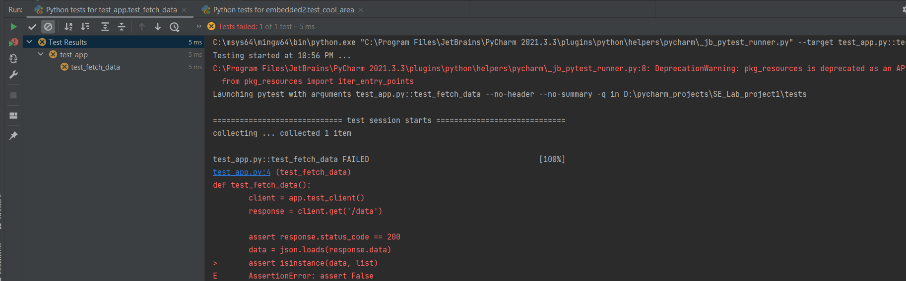
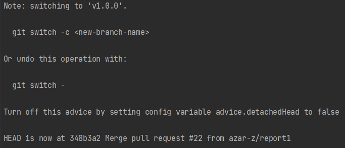
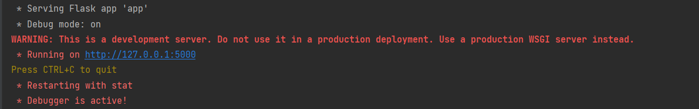

# SE_Lab_project1
# Smart Building IoT Platform: phase one

## Branching Strategy
- **main branch**: Stable and protected.
- **Feature branches**: All new features are developed in separate branches (e.g., `feature/iot-sensors`, `feature/web-dashboard`).
- **Merging Policy**: Changes are only merged into `main` through pull requests after passing CI tests and code reviews.
## Feature Branches
- `feature/iot-sensors`: This branch is responsible for the development of IoT sensor scripts and data collection mechanisms.
- `feature/web-dashboard`: This branch is for building the web-based dashboard to display sensor data.
## Commit Message Standards
To maintain consistency, use the following format for commit messages:
- **feat:** Introduces a new feature (e.g., `feat: Added temperature sensor module`).
- **fix:** Fixes a bug (e.g., `fix: Resolved issue with data parsing`).
- **docs:** Changes related to documentation (e.g., `docs: Updated README with commit guidelines`).
- **refactor:** Improves code structure without changing functionality (e.g., `refactor: Cleaned up sensor.py`).
- **test:** Adds or updates tests (e.g., `test: Added unit tests for sensor module`).
- **chore:** Other minor tasks (e.g., `chore: Updated dependencies`).
Example: git commit -m "feat: Added initial IoT sensor data collection script"

<div dir="rtl" align="right">

# گزارش کار پروژه 
شرح پروژه : 
در این پروژه یک سامانه‌ی نمایش تغییرات دمای محیطی با استفاده از flask و html و js پیاده‌سازی شده است.

## فاز اول: راه اندازی پروژه و استراتژی branching 
در این فاز تمرکز ما بر راه اندازی مخزن گیت، تعریف استراتژی شاخه بندی، ایحاد استاندازدهای کامیت و مدیریت milestones پروژه بود. هدف اصلی این فاز، فراهم سازی یک ساختار منظم برای توسعه همزمان چند ماژول و تسهیل فرایندهای همکاری تیمی بود.
## 1. راه اندازی مخزن 
### اقدامات انجام شده: 
- ایجاد مخزن گیت هاب با نام SE_Lab_project1
- اعمال قوانین حفاظت از شاخه ی زیر بر روی شاخه ی main:
  - Require a pull request before merging 
  - Restrict force pushes 
  - Require at least one approval before merging 
  - Require status checks to pass before merging (e.g., CI/CD)
## 2. ایجاد feature branch ها 
### اقدامات انجام شده: 
- با دستورات زیر، شاخه هایی برای توسعه مجزای ماژول ها ایجاد و به مخزن راه دور push کردیم:
  - `git checkout -b feature/iot-sensors`
  - `git push origin feature/iot-sensors`
  - `git checkout -b feature/web-dashboard`
  - `git push origin feature/web-dashboard`
- هر شاخه برای چه منظوری استفاده میشود؟
  - `feature/iot-sensors`: شاخه‌ای برای توسعه اسکریپت‌های مربوط به جمع‌آوری داده‌های سنسورها.
  - `feature/web-dashboard`: شاخه‌ای برای طراحی و پیاده‌سازی داشبورد وب جهت نمایش داده‌ها.
  - `main`: شاخه اصلی پروژه که محافظت شده و پایدار است.
- قرایند ایجاد شاخه ها با اسکرین شات:
  
## 3. تعیین استانداردهای کامیت و milestones 
### اقدامات انحام شده: 
- تعیین استاندارد برای نوشتن پیام های کامیت:
  - `feat`: اضافه کردن قابلیت جدید
  - `fix`: رفع باگ
  - `docs`: تغییرات مستندات
  - `refactor`: بهبود کد بدون تغییر در عملکرد
  - `test`: اضافه کردن تست
- تعریف milestones کلیدی در گیتهاب
  - `Initial Setup` (راه‌اندازی مخزن و استراتژی شاخه‌بندی)
  - `Feature Development` (توسعه ماژول‌های اولیه)
  - `CI/CD Integration` (پیاده‌سازی فرآیندهای CI/CD)
- ایجاد برچسب برای نسخه پایدار اولیه
  - `git tag -a v1.0.0 -m "first stable version"`
  - `git push origin v1.0.0`
## 4. ایجاد کانبان بورد در گیتهاب 
### اقدامات انجام شده: 
- ایجاد بورد کانبان با ستون های زیر:
  - `Backlog`: وظایف برنامه‌ریزی‌شده
  - `Ready`: وظایف در انتظار شروع
  - `In Progress`: وظایف در حال انجام
  - `In Review`: وظایف در مرحله بررسی و تست
  - `Done`: وظایف تکمیل‌شده
- ثبت issues برای تمامی وظایف یک شامل:
  - `setup`: ایجاد مخزن و تنظیم شاخه‌ها
  - `branching`: ایجاد شاخه‌های feature و مستندسازی آن
  - `documentation`: افزودن دستورالعمل‌های کامیت و Milestones
  - `security`: تنظیم حفاظت از شاخه و GitHub Actions
- تعیین مسئولیت‌ها برای اعضای تیم درگیتهاب.


## فاز دوم: توسعه Feature ها، مدیریت Pull Request ها و بازبینی کد

## 1. توسعه در Feature Branch ها
در این فاز دو دو برنچ iot-sensors و web-dashboard به ترتیب بکند 
و فرانت‌اند پروژه به طور موازی پیاده‌سازی شده و در نهایت با استفاده از pull request و
حداقل یک بازبینی و تایید با برنچ اصلی پروژه ادغام شدند.
### iot sensors
در این برنچ با استفاده از flask یک اپلیکیشن پیاده‌سازی شد که دما را از سنسور دما دریافت کرده و در یک api بیست مورد دمای اخیر گرفته‌شده از سنسور را بازمی‌گرداند.
همچنین دسترسی به url فرانت برنامه نیز از طریق همین اپلیکیشن فراهم می‌شود.
به دلیل عدم دسترسی به سنسور دمای واقعی، دما در واقع به شکل تصادفی تولید می‌شود.
### web dashboard
در این برنچ فرانت پروژه پیاده‌سازی شده است که تنها شامل یک فایل html با script به زبان js است. این قطعه کد آرایه‌ای از دماهای اخیر را با استفاده از api دریافت کرده و سپس نمودار آن‌ها را رسم می‌کند. این نمودار هر ۲ ثانیه به‌روز می‌شود.

** در پیاده‌سازی این داشبورد از gpt کمک گرفته‌شده است. تنها ضعف آن که اصلاح شد عدم error handling بود.

## 2. روال Pull Request
از آن‌جایی که شاخه‌ی main محافظت شده است تمامی تغییرات با استفاده از pull request روی شاخه‌ی اصلی ادغام شده و حداقل به یک بازبینی نیاز داشتند.

همچنین در صورت لزوم کامنت‌های لازم هنگام بازبینی کدد گذاشته شده و پیش از مرج شدن برطرف می‌شدند.
نمونه‌ای از آن در لینک زیر قابل مشاهده است:

https://github.com/azar-z/SE_Lab_project1/pull/14

## 3. ایجاد Git Aliases و ارجاع به Pull Request ها
در این بخش از پروژه یک git alias جهت fetch کردن و همچنین checkout کردن به یک pull request نوشته شد. این alias در فایل .gitconfig سیستم لوکال یکی از اعضای تیم قرارداده شده و تست شد. مستندات مربوط به آن و نحوه‌ی استفاده از آن در GitCommands.md موجود است.

## 4. دغام ابزارهای کیفیت کد

### بررسی کیفیت کد با flake8
با نصب flake8 و همچنین قراردادن config آن در .flake8 می‌توان با اجرای دستوری مانند مثال زیر کیفیت یک فایل پایتون را بررسی کرد:
```
flake8 app.py
```
مواردی مانند indentation غلط و یا import بدون استفاده و ... در این ابزار مورد بررسی قرار می‌گیرند.
در حال حاضر طبق معیارهای این ابزار اخطاری در رابطه با کد پایتون این پروژه وجود ندارد.


### تست با استفاده از pytest
pytest یک ابزار تست به زبان پایتون است.
در این پروژه api اصلی برنامه که مربوط به دریافت لیست دماهای اخیر محیط بود را با استفاده از این ابزار به شکل‌ساده‌ای تست کردیم.

### ایجاد داکیومنت بازبینی کد
با کمک gpt داکیومنتی برای فرایند بازبینی کد ایجاد شد که نسبتا کامل بود. به دلیل استفاده از flake8 و pytest در این پروژه، بررسی این دو مورد نیز به داکیومنت اضافه شد.


## فاز سوم: ادغام DevOps و پیاده‌سازی خط لوله CI/CD
هدف از این فاز، خودکاری ‌سازی برخی از فرایند‌های تکراری به وسیله ابزار Github Actions می‌باشد. در ادامه به توضیح بخش به بخش فایل ci-cd.yaml می‌پردازیم.

## 1- راه‌اندازی پایپ‌لاین CI/CD
در این بخش ابتدا به تعریف نام کلی این ورک‌فلو (که از نوع CI/CD) می‌باشد پرداخته‌ایم. 
در بخش on به عملا به این نکته می‌پردازیم که ورکفلوی مربوطه در چه زمانی باید اجرا شود. برای این مهم از event‌های از پیش تعریف شده‌ی Github Actions استفاده می‌کنیم:
- رویداد push: خط لوله زمانی اجرا می‌شود که تغییراتی به شاخه‌های main یا شاخه‌هایی که با feature/ شروع می‌شوند، پوش (push) شوند.
- رویداد pull_request: خط لوله زمانی اجرا می‌شود که یک Pull Request برای ادغام به شاخه‌های main یا feature/ ایجاد شود.


```
name: CI/CD Pipeline

on:
  push:
    branches:
      - main
      - feature/
  pull_request:
    branches:
      - main
      - feature/
```
لازم به ذکر است که کلیه ورک‌فلو‌های github actions روی سرورهای شرکت github اجرا می‌شوند. در ابتدا شروع این ورک فلو که با واژه jobs آغاز شده و با build شروع به کار می‌کند، لازم است که سیستم عامل مجازی مدنظر خود را انتخاب کنیم. در این آزمایش از آخرین نسخه ubuntu استفاده شده است.


```
jobs:
  build:
    runs-on: ubuntu-latest
```

در ادامه‌ی این پروسه، جاب ساخته شده در تعدادی قدم (step) اجرا می‌شود. هر کدام از این گام‌ها دارای نام و کاربرد (uses) یا بخش اجرایی (run) می‌باشد. برخی اوقات می‌توان برای پروسه‌هایی تکراری از اکشن‌های از پیش آماده‌ی موجود استفاده کرد و در این مواقع از کلید واژه uses استفاده می‌شود. در غیر این صورت به سراغ run می‌رویم.

- گام اول:
این مرحله کد مخزن (Repository) را از گیت‌هاب checkout می‌کند. کاربرد این مرحله، برای دسترسی به کد پروژه و انجام مراحل بعدی مانند نصب وابستگی‌ها و اجرای تست‌ها می‌باشد.

```
  steps:
      - name: Checkout Repository
        uses: actions/checkout@v3
```
- گام دوم:
این مرحله محیط پایتون را تنظیم می‌کند.

`uses: actions/setup-python@v3`: از اکشن رسمی گیت‌هاب برای نصب پایتون استفاده می‌کن.

`python-version`: "3.9": نسخه پایتون ۳.۹ را نصب می‌کند.


```
- name: Set Up Python
  uses: actions/setup-python@v3
  with:
    python-version: "3.9"
```

- گام سوم:
این مرحله دیپندنسی‌های پروژه را نصب می‌کند.

`python -m pip install --upgrade pip`: ابزار pip را به آخرین نسخه ارتقا می‌دهد.

`pip install flake8`: ابزار flake8 را برای تحلیل استاتیک کد نصب می‌کند.

`pip install Flask`: فریم‌ورک Flask را برای اجرای برنامه نصب می‌کند.


```
- name: Install Dependencies
  run: |
    python -m pip install --upgrade pip
    pip install flake8
    pip install Flask  # Install Flask (needed to run Flask app)
```


- گام چهارم:
- در این مرحله تست‌های از پیش نوشته شده اجرا و بررسی شده و همچنین تحلیل‌های استاتیک نیز صورت می‌گیرند.

  `python -m tests.test_app`: فایل تست test_app.py را از پوشه tests اجرا می‌کند.

  `flake8 .`: تمام فایل‌های پروژه را از نظر خطاهای سبک و استانداردهای کدنویسی بررسی می‌کند.


```
  - name: Run Tests
  run: |
    python -m tests.test_app  # Run the test in tests/test_app.py

  - name: Run Static Analysis
  run: |
    flake8 .  # Run static analysis on the entire project
```


## 2- خودکارسازی ادغام شاخه‌ها

- هدف از این مرحله ادغام خودکار کد، پس از صحت‌سنجی در مراحل پیشین می‌باشد. برای این مهم، یک جاب جدید تعریف می‌کنیم.
  
`needs: build`: این Job فقط پس از موفقیت‌آمیز بودن Job build اجرا می‌شود.

`if: success()`: این Job فقط در صورتی اجرا می‌شود که Job قبلی (build) با موفقیت انجام شده باشد.

`runs-on: ubuntu-latest`: این Job نیز روی یک رانر با سیستم عامل Ubuntu اجرا می‌شود.


```
automerge:
  needs: build
  runs-on: ubuntu-latest
  if: success()
```


- گام اول:

این مرحله از اکشن automerge-action برای ادغام خودکار Pull Request استفاده می‌کند. همان‌طور که پیش‌تر نیز گفته شد، برای این مهم، می‌توان از ماژول‌های آماده استفاده کردو در اینجا از یکی ماژول‌های pascalgn استفاده می‌کنیم.

`uses: pascalgn/automerge-action@v0.15.6`: از اکشن automerge-action برای ادغام خودکار استفاده می‌کند.

`env: GITHUB_TOKEN‍‍`: توکن دسترسی گیت‌هاب را برای انجام عملیات ادغام فراهم می‌کند.


```
  steps:
    - name: Enable Auto-Merge
      uses: pascalgn/automerge-action@v0.15.6
      env:
        GITHUB_TOKEN: ${{ secrets.GITHUB_TOKEN }}

```


## 3- خودکارسازی ادغام شاخه‌ها
در این بخش، با کمک سرویس ارسال ایمیل SendGrid به ارسال ایمیل هشدار، برای فرد مدتظر، در هنگام مواجه با ارور یا هرگونه مشکل در پروسه CI/CD می‌پردازیم.

- گام اول:
- در این گام ایتدا مانند بخش قبل به تعیین نام جاب می‌پردازیم.

 
```
- name: Send Failure Notification (Email)
```


این بخش نام مرحله را مشخص می‌کند. در اینجا نام مرحله Send Failure Notification (Email) است.


  if: failure()
در ادامه، این شرط مشخص می‌کند که مرحله فقط در صورت شکست خط لوله اجرا شود. به بیانی دیگر، ایمیل تنها زمانی ارسال می‌شود که بخشی از پایپ‌لاین تا پیش از این بخش، فیل شده باشد.


- گام دوم:

این بخش شامل دستوراتی است که برای ارسال ایمیل از طریق سرویس SendGrid استفاده می‌شود. در ادامه، هر بخش از دستور curl توضیح داده می‌شود.

+ دستور curl


```
curl --request POST \
--url https://api.sendgrid.com/v3/mail/send \
```

این دستور یک درخواست HTTP POST به آدرس API SendGrid ارسال می‌کند تا ارسال ایمیل از طریق آن صورت گیرد.

+ هدر Authorization

```
--header 'Authorization: Bearer ${{ secrets.SENDGRID_API_KEY }}' \
```
این هدر شامل توکن احراز هویت برای دسترسی به API SendGrid است.

`${{ secrets.SENDGRID_API_KEY }}`: این مقدار از Secrets گیت‌هاب خوانده می‌شود و باید شامل کلید API سرویس SendGrid باشد.


+ هدر Content-Type

```
--header 'Content-Type: application/json' \
```
این هدر مشخص می‌کند که داده‌های ارسالی به API در قالب JSON هستند.


+ بدنه درخواست Data

```
--data '{
  "personalizations": [{"to": [{"email": "recipient@example.com"}]}],
  "from": {"email": "your-email@example.com"},
  "subject": "CI/CD Pipeline Failed",
  "content": [{"type": "text/plain", "value": "The CI/CD pipeline failed. Please check the logs for details."}]
}'
```
این بخش شامل اطلاعات ایمیلی است که باید ارسال شود:

`personalizations`: لیست دریافت‌کنندگان ایمیل. در اینجا یک ایمیل به آدرس recipient@example.com ارسال می‌شود.

`from`: آدرس ایمیل فرستنده. در اینجا mohammad.moasayevi@gmail.com به عنوان فرستنده مشخص شده است.

`subject`: موضوع ایمیل. در اینجا موضوع ایمیل CI/CD Pipeline Failed است.

`content`: محتوای ایمیل. در اینجا یک متن ساده با پیام The CI/CD pipeline failed. Please check the logs for details. ارسال می‌شود.


## فاز ۴: مهندسی انتشار و بازیابی از فاجعه

## 1. فرآیند مدیریت انتشار
ابتدا یک تگ برای یک ورژن stable از پروژه ایجاد شد. سپس توضیحات مربوط به آن در ReleaseProcess.md ثبت شد.

## 2. استراتژی‌های بازگشت به نسخه قبلی
در این بخش ابتدا یک فایل rollback.sh ایجاد کردیم که به ورژن v1.0.0 از پروژه برمی‌گردد و پروژه را دوباره اجرا می‌کند.
سپس استراتژی‌های لازم در هنگام فاجعه را در قایل DisasterRecoveryPlan.md مشخص کردیم.


## 3. تست انتشار و بازیابی
برای این کار ابتدا یک کامیت دارای خطا ایجاد کردیم که باعث می‌شود تست موجود در test_app پاس نشود.



سپس rollback.sh را اجرا کردیم که پروژه را به آخرین ورژن stable برمی‌گرداند.
طی این فرایند پروژه به ورژن v1.0.0 رفته و اجرا شد.





</div>